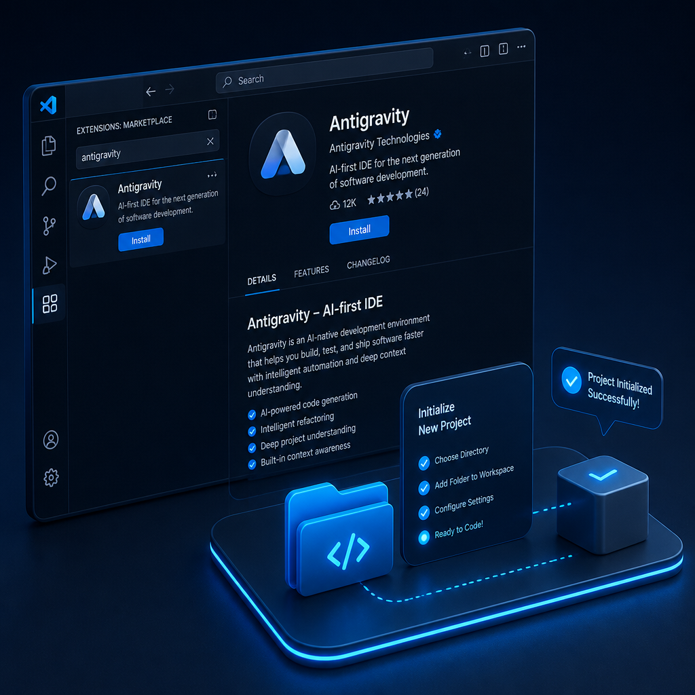
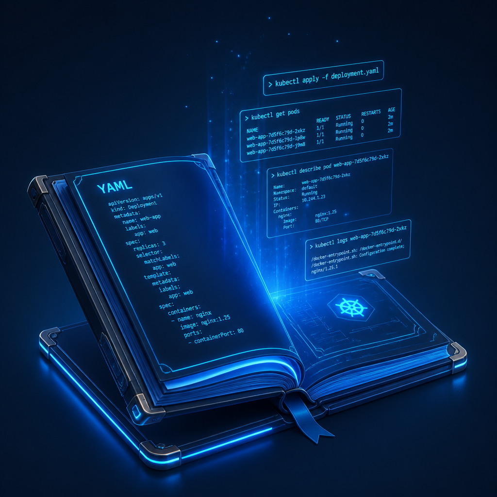
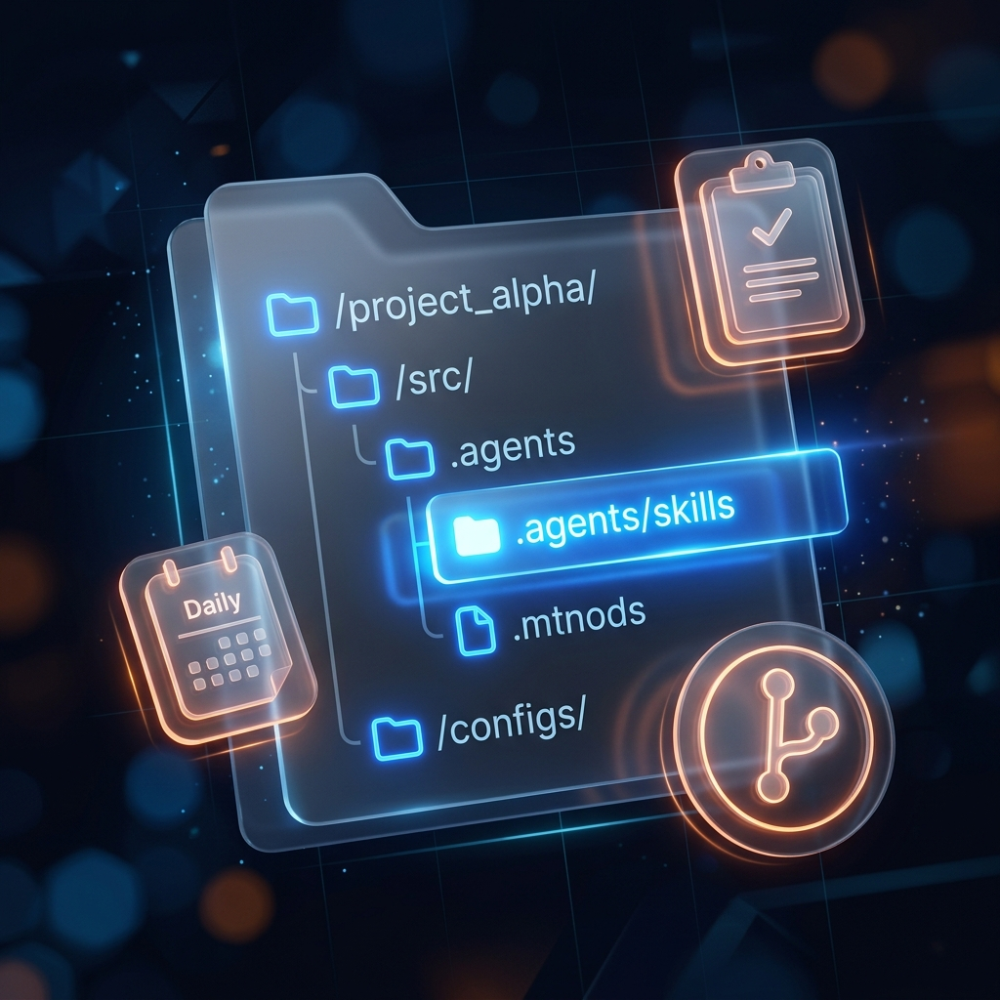
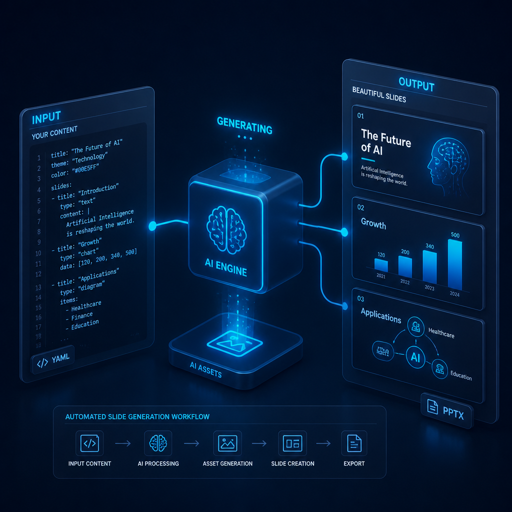

# 從「被動聊天」到「主動做事」
## 教師的 AI Agent (虛擬助教) 實戰啟蒙

---

# 傳統 AI 聊天 vs. AI Agent 助教

- 傳統 AI (Chat)
  - 像「點唱機」：問一句答一句，手動做所有事。
  - 沒有記憶，無法幫您操作電腦或使用工具。
- AI Agent (虛擬助教)
  - 像「實習生」：給它一個「目標」，它會自己想辦法完成。
  - 能讀寫檔案、寫簡單的程式、上網找資料，還會自我除錯。
  - 運作流程：查資料、提計畫、動手做、檢查結果。

---

# 虛擬助教的準備：快速上手

- 快速建置環境
  - 使用 `uv` (極速 Python 套件與環境管理工具)，一鍵建立一個乾淨、不干擾系統的 Python 虛擬工作間。
- 指定專屬工作資料夾 (Workspace)
  - 告訴助教：「你只能在這個資料夾內活動與修改檔案」。
  - 確保助教執行指令與檔案讀寫時的安全，防止動到電腦的其他重要檔案。

---

# 虛擬助教的準備：設定與權限簿

- 全域設定 (Global)
  - 路徑：`C:\Users\vm\.gemini\config`
  - 存放助教通用的密鑰、您的登入帳號與預設 AI 模型。
- 專案設定 (Project)
  - 路徑：專案資料夾下的 `.agents`
  - 存放該專案專屬的工作規則，告訴助教什麼能做、什麼不能做。

---

# 虛擬助教的準備：第一步（安裝軟體與套件）

- 安裝軟體與套件
  - 主程式下載：前往 [antigravity.google/download](https://antigravity.google/download) 下載安裝 Antigravity 2.0 桌面版。
  - 帳戶授權：啟動後登入您的 Google 帳戶完成 AI 權限登記。

---

# 虛擬助教的準備：第二步（建立工作目錄）

- 建立工作目錄
  - 建立一個全新的專案資料夾。
  - 設定好版本控制與虛擬環境，讓助教隨時可以開工。

---

# 設定面板(上)：基礎與權限守則

- 定義助教的基本環境與安全限制
  - General (一般)：設定命令視窗與工作資料夾。(例如：指定專案路徑，防止助教存取其他私人目錄)
  - Account (帳戶)：登入 Google 帳戶啟用 AI 權限。(例如：登入您的 Google 帳號以調用 Gemini 模型)
  - Permissions (權限)：最安全！ 設定執行敏感命令時需老師點擊同意。(例如：助教修改程式碼前會先彈出確認按鈕)
  - Appearance (外觀)：調整介面字型與主題色彩。(例如：切換成高對比暗黑模式，字體放大至 16pt)

---

# 設定面板(下)：進階與客製化守則

- 自訂助教的智能大腦與特殊技能
  - Models (模型)：挑選適合的 AI 模型作為助教的智囊。(例如：選擇高脈絡的 Gemini 1.5 Pro 來分析數小時的影片)
  - Customizations (客製化)：載入特定工作流技能或規則。(例如：匯入 `classroom-video-analyzer` 技能)
  - Browser (瀏覽器)：設定助教上網爬取資料時的設定。(例如：啟用無頭瀏覽器自動抓取學術論文與新聞)
  - App (應用程式)：管理系統暫存與操作日誌。(例如：查看助教昨日的完整歷史運行日誌來進行偵錯)

---

# 脈絡工具：給助教的「參考資料與任務指令」

- `Media (上傳參考資料)`：可以直接把簡報 PDF、課堂照片、影片拉給助教，多模態 AI 能直接看懂排版或 UI 設計。
- `@ 標記提及 (Mentions)`：精準交代資料。標記 `@ 某個檔案` 就像是「直接把考卷遞給助教看」，或指名特定的專業子助教。
- `Actions (快捷動作)`：輸入斜線指令（如 `/goal` 直接交代大目標，`/schedule` 交代定時自動工作）。
- `Browser (網頁瀏覽)`：讓助教開啟瀏覽器上網，抓取最新的時事或學術資料來設計教材。

---

# 實戰演練：一鍵安裝 Antigravity 專屬懶人包

- 快速部署整合環境與 MCP 服務
  - 懶人包下載：下載 [Antigravity 專屬懶人包](https://github.com/mathruffian-dot/antigravity-lazy-pack/tree/main) 內容。
  - 懶人包安裝：將 `09-AntiGravity專屬懶人包.md` 文件提供給助教，並對助教下達「安裝這個懶人包」指令。
  - 💡 懶人包自動配置服務：
    - NotebookLM 整合：自動登入 Google 帳戶並完成憑證升級，確保大腦連線順暢。
    - Obsidian 庫對接：自動連結並索引您的第二大腦本地知識庫。
    - 專案自動化：一鍵設定 Git 版本控制與全域專案初始流程。

---

# 什麼是 Skill？助教的「SOP 教戰手冊」

- Skill (技能) 的結構
  - 它是一份寫好的標準作業程序檔案（如 `SKILL.md`），搭配輔助程式。
- 觸發機制
  - 當老師提出需求（如「我想設計教案」）時，助教若發現手冊有寫，就會自動套用 SOP。
- 教學應用
  - 老師可自訂 `lesson-plan-generator` 或期末考審題手冊，確保助教產出的講義與題目都符合學校的格式標準。

---

# 實戰演練：SOP 技能安裝與觸發

- 技能安裝與工作流實作
  - 技能檔放置：將自訂的 `SKILL.md` 放置於專案 `.agents/skills/<技能名稱>/` 下，系統會自動偵測載入該技能。
  - 開工與收工 SOP：說「開工」時，自動讀取 Obsidian `每日筆記` 並檢查 Git；說「收工」時，自動安全掃描、Git 推送存檔。
  - 專案初始化：說「初始化專案」時，自動建立檔案、Git 倉庫、GitHub 遠端儲存庫與 Obsidian 目錄。

---

# 實戰任務一：NotebookLM 與 Antigravity 協同雙腦工作流

- NotebookLM (大腦 — 負責讀書思考)
  - 適合：讀入講義、課綱、PDF 檔案。
  - 功能：做摘要、整理學習指引、回答老師提問、生成對答語音。
- Antigravity (雙手 — 負責動手建造)
  - 適合：將軍師思考好的架構與大綱，化為實際行動。
  - 功能：啟動 `Planning Mode` (寫企劃書)，自動寫出程式碼、生成簡報、發布網頁。

> 一句話總結：NotebookLM 幫您「讀書動腦」，Antigravity 幫您「動手完成」。

---

# 實戰任務二：課堂影片自動剪接與字幕對齊

> 老師痛點：下課後要把 2 小時的課堂影片剪出重點，還要手動聽寫、對齊字幕，非常耗時。

- 虛擬助教的自動化三步驟：
  1. 聽寫字幕：助教聽取影片聲音，自動生成對齊時間軸的 `.srt` 字幕檔。
  2. 尋找精華：助教自動讀取字幕內容，找出包含關鍵教學重點的時間區段。
  3. 自動剪輯：助教自動寫出剪接指令，剪出重點影片片段並把字幕對齊壓好。

---

# 實戰任務二實務：學習共同體 SLC 觀課 Skill 整合

- 透過安裝 SLC 自訂 Skill 進行觀課分析
  - 第一步：安裝 Skill：下載 [SLC-skill](https://github.com/hsuyiping-rgb/SLC-skill) 技能資料夾，放置於專案 `.agents/skills/` 下以載入技能。
  - 第二步：提供材料並觸發：在工作區放入影片或課堂文字紀錄（如 `slc_lesson.txt`），對助教說「進行學共觀課分析」。
  - 💡 實際測試實作任務：
    - 操作：分析課堂記錄並自動依「學習共同體（SLC）」理論標記傾聽與協同學習歷程。
    - 結果：助教自動分析學生傾聽與協同學習的起始時間、標記師生互動，並一鍵編譯輸出排版精美的 Word 觀課報告 `slc_report.docx`。

---

# 實戰任務三：講義大綱一鍵生成精美投影片

> 老師痛點：每次備課都要花大量時間調整簡報字型、對齊排版，無法專注在內容設計上。

- 虛擬助教的解法：
  - 寫程式生簡報：助教自動寫出 Python 程式，直接產出一份可供老師自由修改的 `.pptx` 簡報檔。
  - 文字大綱秒變投影片：助教撰寫符合 `Marp` 格式的大綱，一鍵轉換成簡報網頁或 PDF。
  - AI 自動畫插圖：助教自動生成適合簡報內容的教學配圖，不用再到處找無版權圖片。

---

# 實戰任務四：隨堂測驗網頁一鍵放上雲端

> 老師痛點：寫好一個互動測驗網頁後，不知道要怎麼放上網路給學生連線使用。

- 虛擬助教的解法：
  - 自動雲端存檔：助教自動幫您把專案做好 Git 控制，一鍵推上雲端代管平台。
  - 一鍵完成網站發布：助教自動跑好 Firebase 部署流程，在幾秒鐘內把網頁推上雲端網站。
- 教學應用：做好的測驗網頁隨即擁有網址，上課時投在螢幕上，學生拿手機掃 QR Code 就能立即連線進行隨堂小測驗！

---

# AI 時代的啟示：教學典範的轉移

- 核心能力的轉變：
  - 學生不一定要死記所有的程式碼語法，而是學習「如何定義目標」、「如何審查助教提的計畫企劃書」，以及「如何使用工具解決問題」。
- 教師角色的轉變：
  - 教師從單純的「板書抄寫與語法教學者」，升級為「引導者與決策者」。
  - 老師審查學生提出的 `implementation_plan.md`，引導學生思考與修正。

---

# Q & A

感謝各位老師的參與！
讓我們一起用「虛擬助教」開啟更輕鬆、更有趣的教學新旅程。

